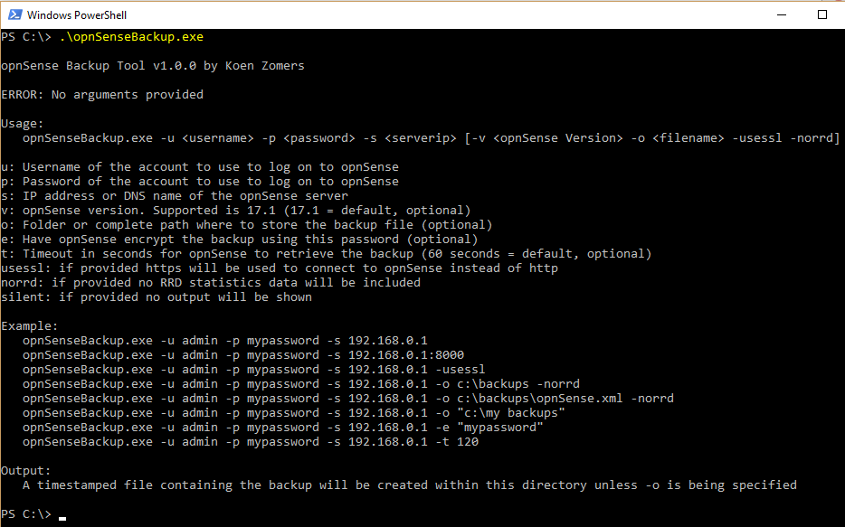
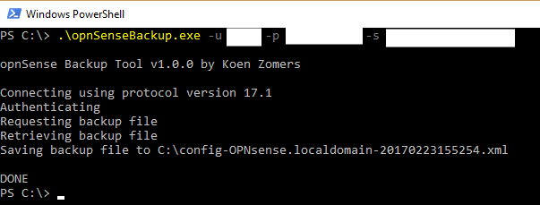

# opnSenseBackup
opnSense Backup allows you to backup the complete configuration of your opnSense server using this command line Windows application. It is easy to include this in a larger script for your backups and schedule it i.e. with the Windows Task Scheduler.

## Download

[Download the latest version](https://github.com/KoenZomers/opnSenseBackup/raw/master/Releases/opnSenseBackupv1.0.zip)

## Release Notes

1.0 - released February 23, 2017 - [download](https://github.com/KoenZomers/opnSenseBackup/raw/master/Releases/opnSenseBackupv1.0.zip) - 10 kb

- Initial release

[Version History](https://github.com/KoenZomers/opnSenseBackup/blob/master/VersionHistory.md)

## Usage Instructions

1. Copy opnSenseBackup.exe to any location on a Windows machine where you want to use the tool
2. Run opnSenseBackup.exe to see the command line options
3. Run opnSenseBackup.exe with the appropriate command line options to connect to your opnSense server and download the backup

## Feedback

Any kind of feedback is welcome! Feel free to drop me an e-mail at mail@koenzomers.nl"# opnSenseBackup" 
